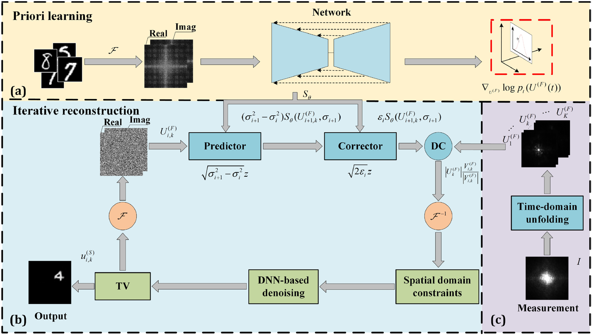

# Diffusion-Models-for-Computational-Optical-Imaging

As an emerging technology, computational optical imaging demonstrates remarkable advantages through its high degrees of freedom, high-dimensional information acquisition capability, and intelligent characteristics. 

The core challenge lies in achieving high-quality image reconstruction through inverse problem solving. 

While traditional regularization methods have improved reconstruction quality to some extent, their robustness and generalizability remain limited when handling complex imaging scenarios. 

Generative artificial intelligence offers a promising solution by learning data distributions to provide more universal and adaptive prior information, thereby enabling new possibilities for high-fidelity image reconstruction.

Generative AI-assisted computational optical imaging, [[CITA2024 PPT](./CITA2024.pptx)]

---

##  ● Learning from Spatial Domain

The final output of computational optical imaging is typically represented in the spatial domain. 

Therefore, prior learning in this domain (including for grayscale images, color images, high-dimensional color images, and complex amplitude images), provides the most direct constraint generation method.

### ● Lens-less imaging via score-based generative model

[[paper](https://ope.lightpublishing.cn/zh/article/doi/10.37188/OPE.20223018.2280/)]   [[code](https://github.com/yqx7150/LSGM)]

### ● Multi-phase FZA Lensless Imaging via Diffusion Model

[[paper](https://opg.optica.org/abstract.cfm?uri=oe-31-12-20595) ]  [[code](https://github.com/yqx7150/MLDM)]

### ● Imaging through scattering media via generative diffusion model

[[paper](https://pubs.aip.org/aip/apl/article/124/5/051101/3176612)]  [[code](https://github.com/yqx7150/ISDM)]

### ● HoloDiffusion: Sparse Digital Holographic Reconstruction via Diffusion Modeling

[[paper](https://www.mdpi.com/2304-6732/11/4/388)]  [[code](https://github.com/yqx7150/Holodiffusion)]

### ● DMEDH: Diffusion Model-boosted Multiplane Extrapolation for Digital Holographic Reconstruction

[[paper](https://opg.optica.org/abstract.cfm?uri=oe-32-18-31920)]  [[code](https://github.com/yqx7150/DMEDH)]

### ● Fluorescence molecular tomography via score-based generative model

[[paper](https://www.sciencedirect.com/science/article/pii/S0143816625000508) ]  [[code](https://github.com/yqx7150/FTSG)]

### ● High-resolution iterative reconstruction at extremely low sampling rate for Fourier single-pixel imaging via diffusion model

[[paper](https://opg.optica.org/oe/fulltext.cfm?uri=oe-32-3-3138&id=545621)]  [[code](https://github.com/yqx7150/FSPI-DM)]

### ● Sparse-view reconstruction for photoacoustic tomography combining diffusion model with model-based iteration

[[paper](https://www.sciencedirect.com/science/article/pii/S2213597923001118)]  [[code](https://github.com/yqx7150/PAT-Diffusion)]

### ● Score-based generative model-assisted information compensation for high-quality limited-view reconstruction in photoacoustic tomography

[[paper](https://www.sciencedirect.com/science/article/pii/S2213597924000405)]  [[code](https://github.com/yqx7150/Limited-view-PAT-Diffusion)]

---

## ● Learning from Frequency Domain

Computational optical imaging can transform signals into the frequency domain through hardware systems, where frequency-domain prior learning provides an additional dimension of constraints.

### ● Frequency domain generative diffusion model for temporal compressive coherent diffraction imaging

[[paper](https://www.sciencedirect.com/science/article/pii/S0143816624004020)]  [[code](https://github.com/yqx7150/FDTC)]

---

## ● Learning from Hybrid Domain

Some computational optical imaging systems employ iterative spatial/frequency domain cycling. Joint spatial-spectral learning and constraints can further enhance imaging quality

### ● Dual-domain mean-reverting diffusion model-enhanced temporal compressive coherent diffraction imaging

[[paper](https://opg.optica.org/abstract.cfm?uri=oe-32-9-15243)]  [[code](https://github.com/yqx7150/DMDTC)]

---

## ● Learning from Transformed Domain

Learning in transform domains (e.g., wavelet domain) can effectively enhance image reconstruction details in computational optical imaging.

### ● Wavelet-refinement-inspired diffusion model for scattering imaging

[paper]  [[code](https://github.com/yqx7150/WIDS)]

---

## Learning from Data Domain

For sparse-sampled computational imaging problems, learning directly in the native data domain of signals provides a more straightforward generative sparse reconstruction scheme.

### Multiple diffusion models-enhanced extremely limited-view reconstruction strategy for photoacoustic tomography boosted by multi-scale priors

[[paper](https://www.sciencedirect.com/science/article/pii/S2213597924000636)]  [[code](https://github.com/yqx7150/MSDM-PAT)]

### Ultra-sparse reconstruction for photoacoustic tomography: sinogram domain prior-guided method exploiting enhanced score-based diffusion model

[[paper](https://www.sciencedirect.com/science/article/pii/S2213597924000879)]  [[code](https://github.com/yqx7150/PAT-Sinogram-Diffusion)]

---

